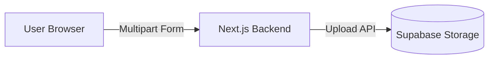
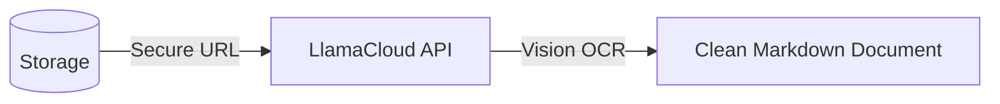
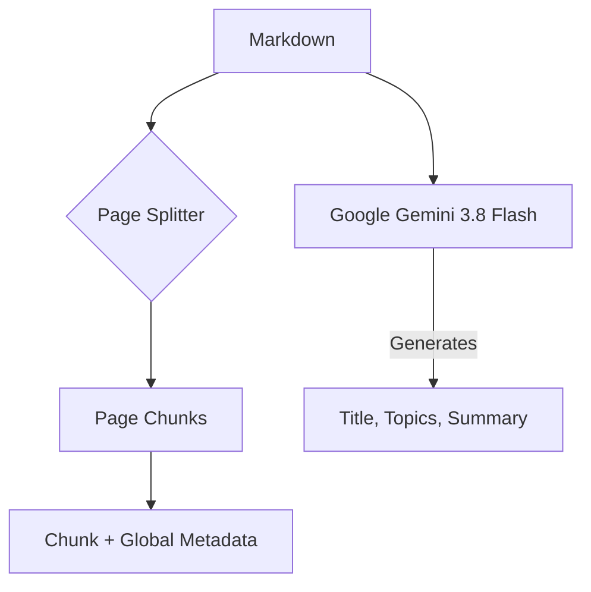
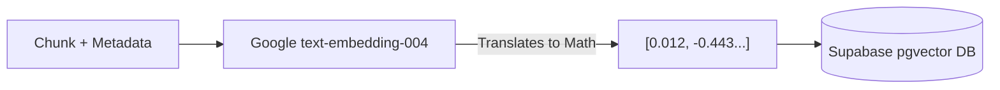
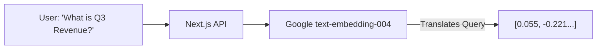
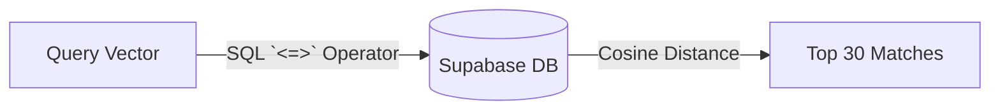
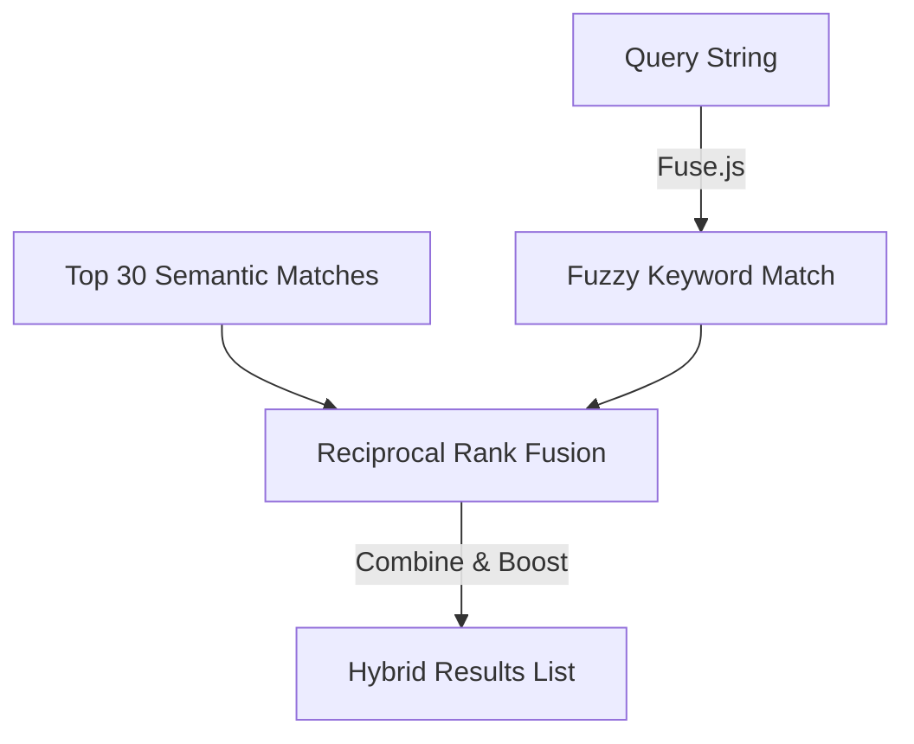
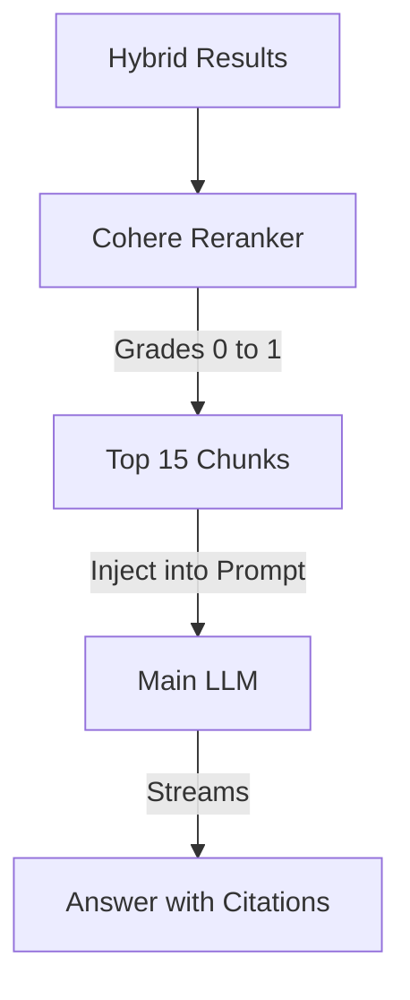

# DocuLens AI: RAG Architecture Exploration

**An educational project built to demonstrate and understand the core components of a modern Retrieval-Augmented Generation (RAG) pipeline.**

This project explores how to build a system that can accurately answer questions based on dense, unstructured PDF documents without hallucinating, using hybrid search and vector embeddings.

## 🎯 The Problem

Large Language Models (LLMs) have a knowledge cutoff and often hallucinate when asked about specific, private, or complex documents. Standard keyword search (Ctrl+F) fails to understand the context or semantics of a query.

**RAG solves this** by translating human language into mathematical vectors, finding the most relevant document chunks, and feeding only those specific chunks to the LLM to generate an answer with exact citations.

---

## 🔍 Deep Dive: The RAG Pipeline Step-by-Step

This section breaks down the entire architecture into granular micro-steps. You can use this guide to walk through exactly how data transforms from a physical PDF into an intelligent answer.

### Phase 1: Document Ingestion

#### Step 1: Upload & Secure Storage
The first step is moving the physical PDF from the user's computer to the cloud securely.

* **How it works:** We don't store files directly on the server. The file is streamed to a secure Supabase Storage bucket (`userfiles`). Supabase applies Row Level Security (RLS) so only the owner can access it, returning a secure URL for the next step.

#### Step 2: Vision Parsing (LlamaCloud)
Standard PDF parsers fail at complex tables and layouts. We use Vision AI to read the document.

* **How it works:** Instead of scraping raw text, LlamaCloud uses vision models to understand the *layout* of the page (headers, columns, tables). It translates complex nested data into perfectly formatted Markdown, ensuring tables aren't jumbled into unreadable paragraphs.

#### Step 3: Metadata & Chunking
Before doing math on the text, we must organize and summarize it.

* **How it works:** You can't feed an entire book into an embedding model. We split the document page-by-page. Simultaneously, a mini-LLM reads the text and generates "Global Metadata" (title, summary, key topics). This metadata is attached to *every single chunk* so the system always knows the overarching context.

#### Step 4: Vectorization & Database Storage
Translating human language into machine mathematics.

* **How it works:** Every chunk is sent to Google's embedding model, returning a vector array of exactly 768 numbers. These numbers represent the semantic meaning of the text. We save the original text, metadata, and this vector into Supabase using the `pgvector` extension.

---

### Phase 2: Chat & Retrieval

#### Step 5: Query Embedding
When the user asks a question, we must speak the database's mathematical language.

* **How it works:** The user asks a question in plain English. To find the answer, we convert the question into a vector using the *exact same model* used during ingestion.

#### Step 6: Semantic Vector Search
Calculating the mathematical distance between the question and the answers.

* **How it works:** We send the Query Vector to the database. Supabase calculates the "Cosine Similarity" (the angle) between the question vector and every document vector. A smaller angle means the texts are semantically related.

#### Step 7: Keyword Search & RRF (Hybrid Search)
Fixing the flaws of vector search using old-school text matching.

* **How it works:** Vector search is bad at finding exact names or part numbers. We run a secondary "Fuzzy Keyword Search" against the text. Then, we use **Reciprocal Rank Fusion (RRF)**. If a chunk ranks high in *both* the Vector search and the Keyword search, its score is massively boosted.

#### Step 8: Cohere Reranking & LLM Generation
The final filter and the generation of the answer.

* **How it works:** Vector search is fast but noisy. We send the hybrid results to Cohere's Reranking model, which reads the query and chunk side-by-side to give an exact relevance grade. We keep the top 15 chunks, inject them into a massive System Prompt, and ask the main LLM to generate the final answer with clickable Markdown citations.

---

## 🛠️ Core RAG Stack

- **Framework**: Next.js 16 with App Router
- **Vector Database**: Supabase (PostgreSQL with `pgvector`)
- **Embeddings**: Google `text-embedding-004`
- **Document Parser**: LlamaCloud
- **Reranker**: Cohere `rerank-english-v3.0`
- **Orchestration**: Vercel AI SDK

## 🚀 Local Setup

### 1. Clone & Install
```bash
git clone https://github.com/Dhanush3620/docuRAG.git
cd doculens-ai
npm install
```

### 2. Environment Variables
Copy `.env.example` to `.env.local` and add your keys for Supabase, Google AI (Gemini), and LlamaCloud.

### 3. Database Setup (Vector Config)
Run the SQL in `database/setup.sql` in your Supabase SQL Editor. This sets up:
- **Embedding Model**: `text-embedding-004` (768 dimensions)
- **Index**: HNSW with `m=16`, `ef_construction=64`

### 4. Start Development Server
```bash
npm run dev
```

## 📂 Architecture Mapping

To understand the code implementation, look at these specific files:
- **`app/api/processdoc/route.ts`**: The ingestion pipeline (Steps 2-4).
- **`app/api/chat/tools/documentChat.ts`**: The retrieval pipeline (Steps 5-8).
- **`database/setup.sql`**: The vector database schema (Step 6).

## 📝 License
MIT License
